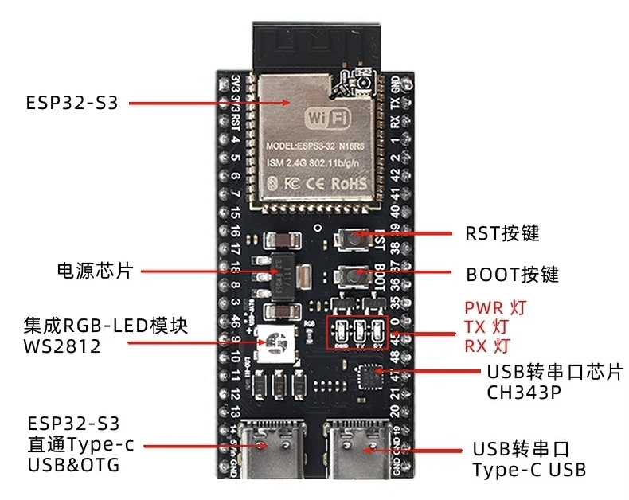
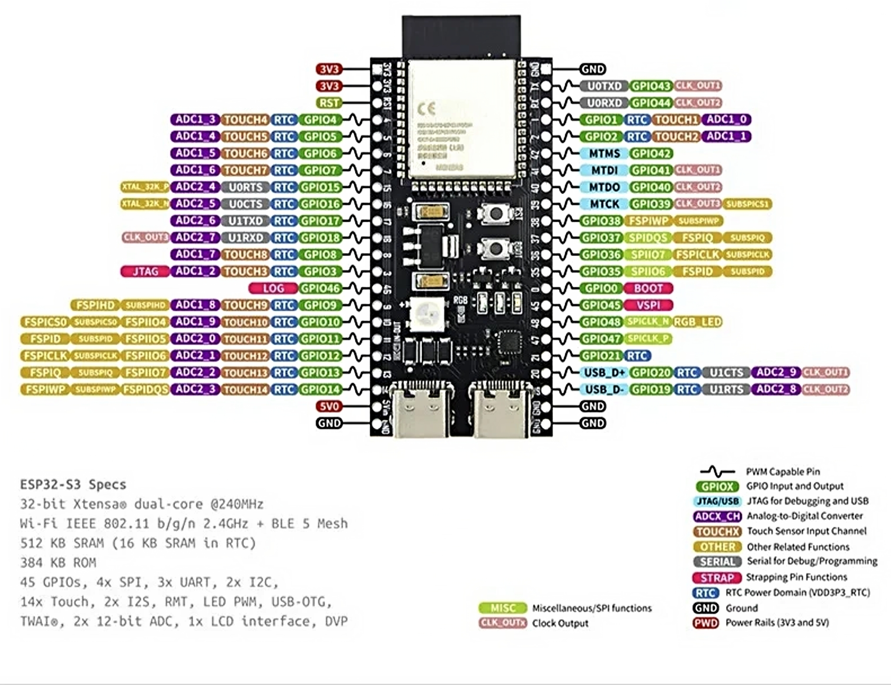

# Examples

本目录提供 WeldControl BLE SDK 的设备端参考示例。示例用于验证协议交互、配对鉴权、Dashboard 数据流、设置读写、自检、控制命令和 OTA 流程，不等同于量产固件。

## 当前测试硬件

当前 ESP-IDF 示例主要使用一块 ESP32-S3 双 Type-C 开发板进行联调。

硬件特征：

| 项目 | 当前测试用途 |
| --- | --- |
| ESP32-S3 模组 | 运行 ESP-IDF C 示例或作为外置 BLE 模块测试主控 |
| Type-C USB/OTG 口 | ESP32-S3 原生 USB 下载、日志或调试 |
| USB 转串口 Type-C 口 | CH343P 串口下载、日志和监视 |
| BOOT 按键 | 示例中用于进入配对模式、确认配对、拒绝配对等测试动作；不同板卡可能接 GPIO0、GPIO9 或其他引脚 |
| RST 按键 | 复位设备 |
| WS2812 RGB LED | ESP-IDF 示例中用于显示配对和连接状态，默认使用 GPIO48 |
| GPIO35 / GPIO36 | 当前外置 BLE 模块 2 透明传输测试的 UART1 接线 |
| GPIO47 / GPIO48 | 外置 BLE 模块 3 测试接线；GPIO48 同时是板载 RGB LED，需要避免同时占用 |

不同 ESP32-S3 开发板的 BOOT、RGB LED、串口和 Type-C 接线可能不同。示例里的按键 GPIO 仅供参考，移植时应先核对原理图和引脚定义，再修改示例中的 GPIO。

## 示例目录

| 目录 | 说明 |
| --- | --- |
| `micropython_device/` | MicroPython 设备模拟示例，适合快速理解协议流程和命令派发 |
| `esp_idf_device_test/` | ESP-IDF C SDK 设备测试工程，适合在 ESP32-S3 上验证完整 BLE 链路 |

## 业务流程覆盖

当前 demo 主要覆盖以下协议流程：

| 流程 | 覆盖内容 |
| --- | --- |
| 设备信息 | `CMD_DEVICE_GET_INFO`，返回序列号、协议版本、功能掩码和 OTA 参数 |
| 配对鉴权 | 配对请求、等待物理确认、确认成功、拒绝、确认超时、token 鉴权和 token 失效 |
| Dashboard | init、start、stop、实时 compact 数据、点焊记录和日志上报 |
| Settings | 当前参数读取、自检读取、应用预设、恢复设置 |
| 控制命令 | 手动触发测试、安全放电、停止放电、开始充电、暂停充电的模拟 ACK |
| OTA | start、data、verify、abort 的协议态校验，以及反复开始/取消后的接收链路恢复 |

## 测试流程

1. 烧录或部署 demo 固件。
2. 打开上位机或 App，扫描设备名 `Weld_Control` 或兼容名称。
3. 读取设备信息，确认序列号、协议版本、功能掩码和 OTA 参数可解析。
4. 长按 BOOT 约 3 秒进入配对模式，再发起配对。
5. 收到等待确认提示后，再次长按 BOOT 确认并保存 token。
6. 进入 Dashboard，验证初始化数据、实时数据流、点焊记录和日志上报。
7. 进入 Settings，验证当前参数读取、自检读取、应用预设和恢复设置。
8. 使用小文件验证 OTA start / data / verify / abort 流程。
9. 连续执行开始 OTA、取消 OTA、重新开始 OTA，确认设备不会因残留半帧卡住，后续设置读取、重置和重新 OTA 仍可收到 ACK。
10. 断开重连后，验证 token 鉴权路径。

## 配对按键语义

demo 默认用 BOOT 作为物理确认入口，具体 GPIO 以目标工程代码为准：

| 操作 | 行为 |
| --- | --- |
| 未等待确认时长按 BOOT | 进入配对模式 |
| 等待确认时长按 BOOT | 接受当前配对请求并返回 token |
| 等待确认时单击 BOOT | 拒绝当前配对请求并延迟断开 |
| 三击 BOOT | 断开当前连接并退出配对模式 |

## Demo 注意事项

1. 示例中的业务动作多为协议联调模拟逻辑。手动触发、安全放电、充电控制和 OTA 写入不会直接控制真实硬件功率输出。
2. 示例设备序列号、厂商 ID、产品 ID、功能掩码、固件版本等信息只是联调默认值，正式设备应使用自己的稳定参数。
3. 配对 token 示例仅用于验证流程。正式固件应使用可靠随机数、持久化存储和必要的擦除策略。
4. 不要修改已发布 CMD、payload 字段 offset、长度、单位和语义。协议问题优先提交 issue 或 PR。
5. BLE 连接后应重新发现 service / characteristic，不要跨连接缓存 GATT handle。
6. 如果使用外置 BLE 模块，需要确认模块是否支持 SDK 16-bit UUID、Notify、Write / Write Without Response 和透明传输。
7. demo 的接收链路必须能从半帧中恢复。OTA abort 后仍可能收到残留 `CMD_OTA_DATA` 字节，示例会通过 parser reset / 半帧超时避免旧 payload 吞掉后续命令。
